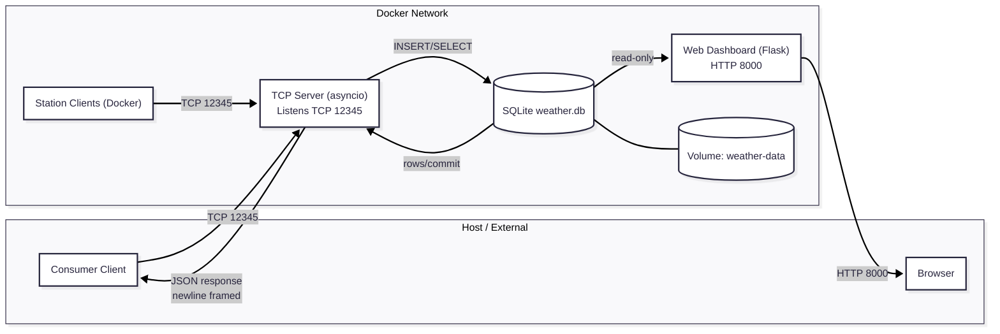

```mermaid
---
config:
  look: neo
  theme: redux
---
flowchart LR
  subgraph HostExternal [Host / External]
    consumer[Consumer Client]
    browser[Browser]
  end

  subgraph DockerNet [Docker Network]
    station["Station Clients (Docker)"]
    server["TCP Server (asyncio)<br/>Listens TCP 12345"]
    sqlite[("SQLite weather.db")]
    web["Web Dashboard (Flask)<br/>HTTP 8000"]
    volume[("Volume: weather-data")]
  end

  station -->|TCP 12345| server
  consumer -->|TCP 12345| server
  server -->|INSERT/SELECT| sqlite
  sqlite -->|rows/commit| server
  sqlite -->|read-only| web
  web -->|HTTP 8000| browser
  server -->|JSON response<br/>newline framed| consumer
  sqlite --- volume
```