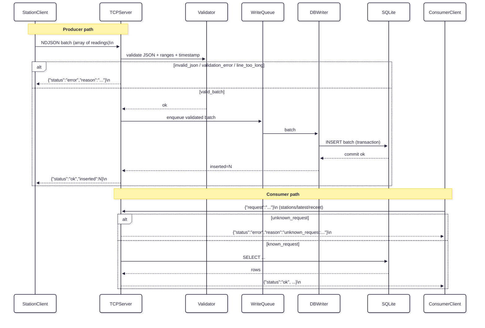

```mermaid
---
config:
  look: neo
  theme: redux
---
sequenceDiagram
    participant StationClient
    participant TCPServer
    participant Validator
    participant WriteQueue
    participant DBWriter
    participant SQLite
    participant ConsumerClient

    Note over StationClient,TCPServer: Producer path
    StationClient ->> TCPServer: NDJSON batch (array of readings)\n
    TCPServer ->> Validator: validate JSON + ranges + timestamp
    alt invalid_json / validation_error / line_too_long
        TCPServer -->> StationClient: {"status":"error","reason":"..."}\n
    else valid_batch
        Validator -->> TCPServer: ok
        TCPServer ->> WriteQueue: enqueue validated batch
        WriteQueue ->> DBWriter: batch
        DBWriter ->> SQLite: INSERT batch (transaction)
        SQLite -->> DBWriter: commit ok
        DBWriter -->> TCPServer: inserted=N
        TCPServer -->> StationClient: {"status":"ok","inserted":N}\n
    end

    Note over ConsumerClient,TCPServer: Consumer path
    ConsumerClient ->> TCPServer: {"request":"..."}\n (stations/latest/recent)
    alt unknown_request
        TCPServer -->> ConsumerClient: {"status":"error","reason":"unknown_request:..."}\n
    else known_request
        TCPServer ->> SQLite: SELECT ...
        SQLite -->> TCPServer: rows
        TCPServer -->> ConsumerClient: {"status":"ok", ...}\n
    end
```