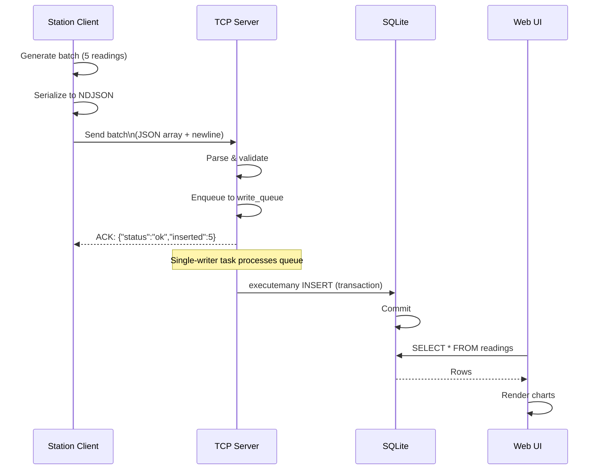
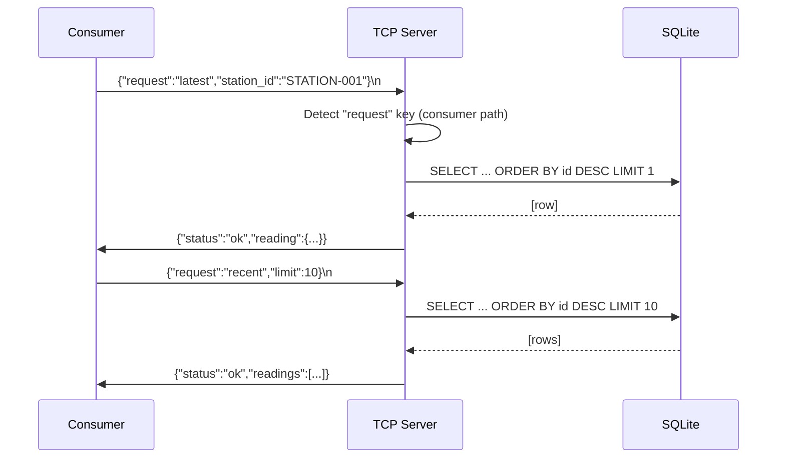

# System Overview — The Weather Station Simulator

## What is This System?

The Weather Station Simulator is a distributed, real-time data platform that demonstrates:
- **Socket-based networking:** TCP clients send sensor readings to a central server
- **Message validation & protocol handling:** Multiplexed producer batches and consumer queries
- **Persistent storage:** SQLite database with concurrent access patterns
- **Web visualization:** Dashboard for live metrics and historical trends
- **Resilience patterns:** Client reconnection with exponential backoff + local buffering

## Key Components

| Component | Role | Port | Technology |
|-----------|------|------|------------|
| **TCP Server** (`server/app.py`) | Accepts JSON batches/requests; validates; persists to SQLite via single-writer queue | 12345 | Python asyncio |
| **Station Client** (`station_client/client.py`) | Generates sensor readings; sends NDJSON batches; auto-reconnects on failure | (→12345) | Python asyncio + deque buffer |
| **Web Dashboard** (`web/web.py`) | Flask app serving REST API + HTML UI; reads SQLite for charts/stats | 8000 | Flask + Chart.js |
| **Consumer Client** (`consumer_client/test_consumer.py`) | Test harness sending read-only requests (stations/latest/recent) | (→12345) | Python asyncio |

## Data Flow Diagrams

### Producer Path: Station → Server → SQLite → Web UI



### Consumer Path: Consumer → Server → SQLite → Response



## Protocol Summary

### Producer Batch (Client → Server)

**Format:** Newline-delimited JSON array

```json
[
  {
    "station_id": "STATION-001",
    "timestamp": "2025-01-17T14:30:45Z",
    "temperature": 22.5,
    "humidity": 58.3,
    "windspeed": 4.2
  }
]
```

**Constraints:** 1–50 readings per batch, max 65536 bytes per line
**Response:** `{"status": "ok", "inserted": <count>}` or `{"status": "error", "reason": "..."}`

### Consumer Request (Client → Server)

**Format:** Newline-delimited JSON object with `"request"` key

```json
{"request": "stations"}
{"request": "latest", "station_id": "STATION-001"}
{"request": "recent", "limit": 10}
```

**Response:** JSON object with `"status"` + data fields

```json
{"status": "ok", "stations": ["STATION-001", "STATION-002"]}
{"status": "ok", "reading": {...}}
{"status": "ok", "readings": [...]}
```

## Database Schema

```sql
CREATE TABLE readings (
    id INTEGER PRIMARY KEY AUTOINCREMENT,  -- Auto-incrementing row ID
    station_id TEXT,                       -- Station identifier
    timestamp TEXT,                        -- ISO 8601 string (UTC)
    temperature REAL,                      -- °C (-10 to 40)
    humidity REAL,                         -- % (0 to 100)
    windspeed REAL                         -- m/s (0 to 50)
)
```

**Key properties:**
- `id` is used for "latest" queries: `ORDER BY id DESC LIMIT 1`
- `timestamp` is stored as ISO 8601 string; web layer parses for time-range queries
- No explicit indexes (for simplicity); add `(station_id, id DESC)` and `(timestamp)` for production scale

## Ports & Configuration

### Server

| Variable | Default | Purpose |
|----------|---------|---------|
| `DB_PATH` | `/app/data/weather.db` | SQLite file path (inside Docker volume) |
| `PORT` | 12345 | TCP port (hardcoded) |
| `HOST` | 0.0.0.0 | Bind address (hardcoded) |

### Station Client

| Variable | Default | Purpose |
|----------|---------|---------|
| `WEATHER_STATION_HOST` | localhost | Server host |
| `WEATHER_STATION_PORT` | 12345 | Server port |
| `WEATHER_STATION_ID` | STATION-001 | Station identifier |
| `WEATHER_STATION_BATCH_INTERVAL` | 5 | Seconds between batches |
| `WEATHER_STATION_BATCH_MIN/MAX` | 1 / 1 | Readings per batch range |
| `WEATHER_STATION_TIMEOUT` | 5.0 | Response timeout (sec) |
| `WEATHER_STATION_CONNECT_TIMEOUT` | 10.0 | Connection timeout (sec) |

### Web UI

| Variable | Default | Purpose |
|----------|---------|---------|
| `WEATHER_DB_PATH` | ../data/weather.db | SQLite file path |
| `WEB_HOST` | 127.0.0.1 | Flask bind address |
| `WEB_PORT` | 8000 | Flask port |

## Architecture Invariants

1. **Single writer to SQLite:** Only `db_writer_task()` in server holds database connection for writes; prevents lock contention
2. **All-or-nothing batches:** Validation fails on first error; either entire batch is inserted or nothing is
3. **Multiplexed protocol:** Producer batches (JSON arrays) and consumer requests (JSON dicts with "request") on same TCP stream
4. **Local buffering:** Clients buffer up to 1000 readings when disconnected; resume from buffer on reconnect
5. **Exponential backoff:** Clients wait 1s → 60s between reconnect attempts; add 0–1s jitter to avoid thundering herd

## Related Documentation

- [app_py.md](app_py.md) — TCP server logic, request multiplexing, DB writer
- [protocol_py.md](protocol_py.md) — Batch validation, timestamp/number checking, constants
- [client_py.md](client_py.md) — Station client, batching, resilience, buffering
- [web_web_py.md](web_web_py.md) — Flask API endpoints, stats aggregation, DB queries
- [web_index_html.md](web_index_html.md) — Dashboard HTML layout
- [web_app_js.md](web_app_js.md) — Dashboard logic, Chart.js rendering, rolling average
- [web_styles_css.md](web_styles_css.md) — Dashboard styling
- [docker_compose_yml.md](docker_compose_yml.md) — Service orchestration (normal mode)
- [docker_compose_stress_yml.md](docker_compose_stress_yml.md) — Service orchestration (stress test)
- [dockerfile_server.md](dockerfile_server.md) — Server container image
- [dockerfile_station_client.md](dockerfile_station_client.md) — Client container image
- [dockerfile_web.md](dockerfile_web.md) — Web UI container image
- [test_api_py.md](test_api_py.md) — API sanity check script
- [test_consumer_py.md](test_consumer_py.md) — Consumer protocol tests

---

**Document Version:** 1.0  
**Scope:** Educational reference for socket programming, databases, Docker, and resilience patterns
