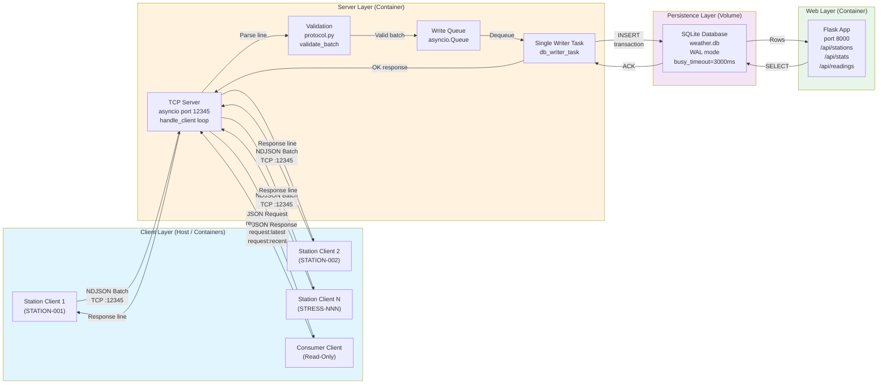
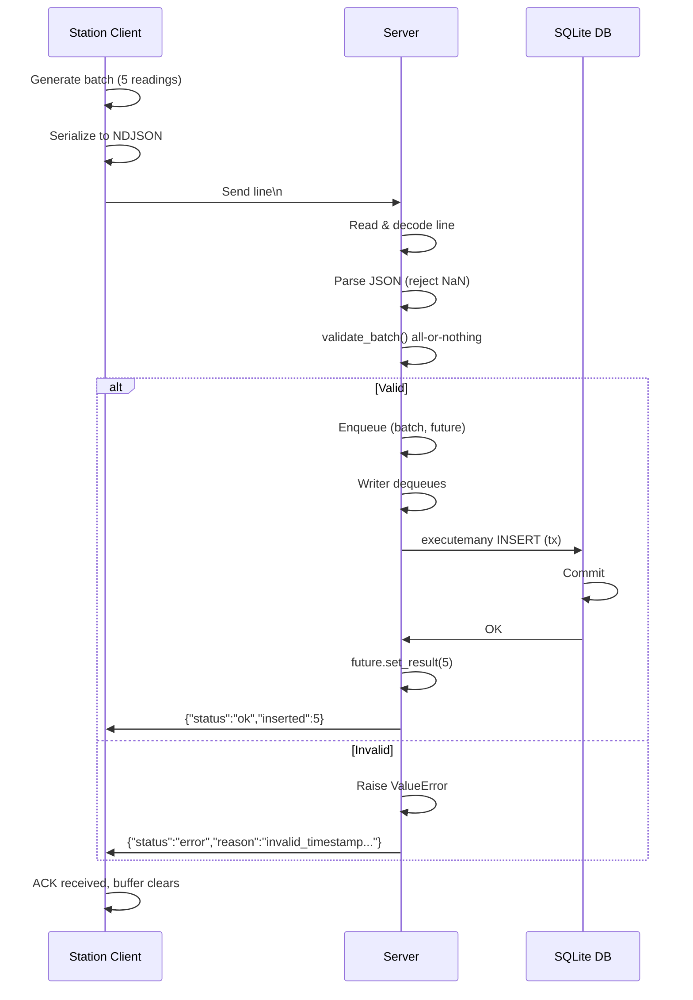
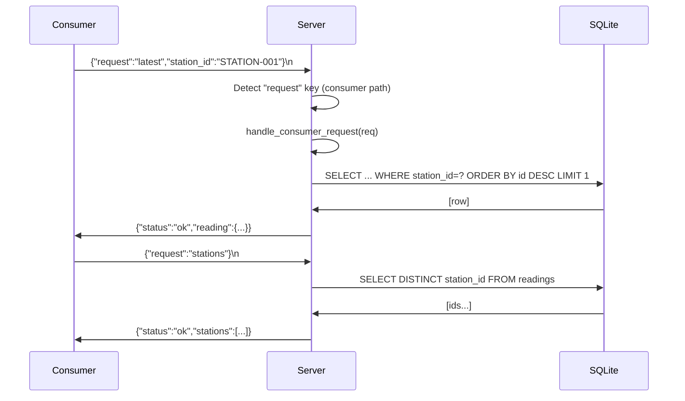

# Weather Station System: Architecture & Design Decisions

## 1. Overview

The Weather Station system is a real-time data ingestion platform where distributed weather station clients continuously send sensor readings (temperature, humidity, windspeed) to a central TCP server over sockets. The server validates, batches, and persists data in an embedded SQLite database with strict ACID guarantees. A Flask web dashboard reads from the same database to provide live visualization. Optional consumer clients can query the server for readings without altering state—all over the same multiplexed TCP protocol.

**Main components:**

- **TCP Server** (`server/app.py`): Asyncio-based listener accepting newline-delimited JSON batches; multiplexes producer (write) and consumer (read) requests.
- **Weather Station Clients** (`station_client/client.py`): Autonomous, resilient generators producing sensor readings with deterministic-plus-noise characteristics; send batches every N seconds with reconnect/backoff.
- **Web Dashboard** (`web/web.py`): Flask application serving REST API endpoints (`/api/stations`, `/api/stats`, `/api/readings`) and a browser dashboard; queries SQLite directly (read-only).
- **Consumer Clients** (`consumer_client/test_consumer.py`): Optional test harness demonstrating read-only socket requests (stations, latest, recent).
- **Persistence Layer**: SQLite database (`/app/data/weather.db`) with single "readings" table; configured for WAL + relaxed sync to balance durability and concurrency.

---

## 2. System Architecture Diagram



---

## 3. How Components Talk: Data Flow

### 3A. Producer Ingest Path (Station → Server → DB)

**Narrative:** A weather station generates a batch of sensor readings with deterministic means plus random noise. Each reading is a JSON object with station ID, ISO 8601 timestamp, and three metrics (temperature, humidity, windspeed). The client encodes the batch as a JSON array, appends a newline, and writes it as one "line" to the TCP socket.

The server's `handle_client()` function reads this line using `reader.readline()` (enforced limit = `MAX_LINE_SIZE` + 1 = 65537 bytes). It decodes UTF-8, parses JSON safely (rejecting NaN/Infinity), and checks if this is a producer batch (JSON array) or consumer request (JSON dict with "request" key). For a batch, it calls `validate_batch()` from `protocol.py`.

`validate_batch()` performs all-or-nothing validation:
- Batch must be a list with ≤50 readings.
- Each reading must have: station_id (safe non-empty string, max 64 chars), timestamp (valid timezone-aware ISO 8601), temperature (-40 to 85 °C, finite), humidity (0–100 %, finite), windspeed (0–100 m/s, finite).

If validation passes, the batch is enqueued to `write_queue` with a result future. The single `db_writer_task()` dequeues and performs `executemany()` in a transaction. On commit, the future is resolved with the insert count. The client receives `{"status":"ok","inserted":<count>}`. If validation fails or a database error occurs, the client receives `{"status":"error","reason":"<message>"}` and the connection remains open for retries.

If the connection drops during send, the client's local buffer accumulates unacknowledged batches (up to 1000 readings) and retries with exponential backoff (1s → 60s) + 0–1s jitter after each reconnect.



### 3B. Consumer Query Path (Consumer → Server → DB → Response)

**Narrative:** A consumer client opens a socket and sends a single JSON line with a "request" field. Supported requests:

- `{"request":"stations"}` → returns unique station IDs from DB.
- `{"request":"latest"}` or `{"request":"latest","station_id":"STATION-001"}` → returns newest reading (by id DESC, limit 1).
- `{"request":"recent","limit":50}` or with `station_id` → returns last N readings (default 50, max 500).

The server's `handle_client()` detects the "request" key and routes to `handle_consumer_request()`. This function runs read-only SELECT queries against SQLite (each opens a fresh connection with busy_timeout = 3000ms). Results are formatted as JSON and sent back in a single response line. Unlike producer batches, consumer requests do not modify state and do not queue; the response is synchronous.

If the request type is unknown, the server replies with `{"status":"error","reason":"unknown_request:<type>"}`. The consumer may then close the socket or send another request.



---

## 4. Protocol Specification

### 4.1 Message Framing

All communication is **newline-delimited JSON** (NDJSON). Each line is one message (batch or request), encoded as UTF-8, terminated with `\n`. The server enforces a maximum line size of **65536 bytes** (`MAX_LINE_SIZE`). Lines exceeding this trigger `asyncio.LimitOverrunError`, and the server responds with `{"status":"error","reason":"line_too_long"}` then closes the connection.

### 4.2 Producer Message Format (Batch Ingest)

A producer batch is a JSON array of reading objects. Example:

```json
[
  {
    "station_id": "STATION-001",
    "timestamp": "2025-01-17T14:30:45.123Z",
    "temperature": 22.5,
    "humidity": 58.3,
    "windspeed": 4.2
  },
  {
    "station_id": "STATION-001",
    "timestamp": "2025-01-17T14:30:50.456Z",
    "temperature": 22.6,
    "humidity": 58.1,
    "windspeed": 4.3
  }
]
```

**Required fields per reading:**

| Field | Type | Range / Constraint | Example |
|-------|------|-------------------|---------|
| `station_id` | string (non-empty) | 1–64 chars, letters/numbers/underscore/dash/dot/colon | `"STATION-001"` |
| `timestamp` | string (timezone-aware ISO 8601) | Formats: `2025-01-17T14:30:45Z` or `2025-01-17T14:30:45+00:00`; stored normalized to UTC | `"2025-01-17T14:30:45Z"` |
| `temperature` | number (finite) | –40 to 85 °C | `22.5` |
| `humidity` | number (finite) | 0 to 100 % | `58.3` |
| `windspeed` | number (finite) | 0 to 100 m/s | `4.2` |

**Batch constraints:**

- Batch must be a JSON array.
- Batch size: 1 ≤ length ≤ 50 (`MAX_BATCH_SIZE`).
- Each element must be a valid reading dict.
- **All-or-nothing:** If any reading fails validation, the entire batch is rejected and nothing is inserted.

**Server response (producer):**

Success:
```json
{"status": "ok", "inserted": 2}
```

Error:
```json
{"status": "error", "reason": "invalid temperature at index 0 (expected -40..85)"}
```

### 4.3 Consumer Message Format (Read-Only Request)

A consumer request is a JSON object with a "request" key and optional parameters. Examples:

```json
{"request": "stations"}
```

```json
{"request": "latest", "station_id": "STATION-001"}
```

```json
{"request": "recent", "station_id": "STATION-002", "limit": 10}
```

**Supported request types:**

| Type | Parameters | Response |
|------|-----------|----------|
| `"stations"` | None | `{"status": "ok", "stations": ["STATION-001", "STATION-002", ...]}` |
| `"latest"` | `station_id` (optional) | `{"status": "ok", "reading": {...}}` or `null` if no data |
| `"recent"` | `station_id` (optional), `limit` (default 50, max 500, int) | `{"status": "ok", "readings": [...]}` |

**Server responses (consumer):**

Success (stations):
```json
{"status": "ok", "stations": ["STATION-001", "STATION-002"]}
```

Success (latest):
```json
{
  "status": "ok",
  "reading": {
    "station_id": "STATION-001",
    "timestamp": "2025-01-17T14:30:45Z",
    "temperature": 22.5,
    "humidity": 58.3,
    "windspeed": 4.2
  }
}
```

Success (recent):
```json
{
  "status": "ok",
  "readings": [
    {"station_id": "STATION-001", "timestamp": "2025-01-17T14:30:50Z", ...},
    {"station_id": "STATION-001", "timestamp": "2025-01-17T14:30:45Z", ...}
  ]
}
```

Error (unknown request):
```json
{"status": "error", "reason": "unknown_request:typo"}
```

Error (server error):
```json
{"status": "error", "reason": "server_error: <exception details>"}
```

### 4.4 Validation & Guardrails

**JSON parsing ([`server/app.py`](server/app.py), `_safe_json_loads()`):**
- Rejects JSON with `NaN`, `Infinity`, or `-Infinity` constants; Python's `json.loads()` would parse these as float objects, but the validator rejects non-finite numbers. This ensures data integrity over wire protocols that may not support these IEEE special values.

**Timestamp validation ([`server/protocol.py`](server/protocol.py), `validate_timestamp()`):**
- Accepts ISO 8601 format with `Z` suffix or explicit timezone offset (e.g., `+00:00`, `-05:00`).
- Normalizes `Z` to `+00:00` and parses with Python's `datetime.fromisoformat()`.
- Raises `ValueError` if format is invalid.

**Numeric validation ([`server/protocol.py`](server/protocol.py), `validate_finite_number()`):**
- Ensures value is `int` or `float` (not `bool`, not string).
- Checks `math.isfinite()` to reject `NaN` and infinity.
- Raises `ValueError` if not finite or wrong type.

**Range validation ([`server/protocol.py`](server/protocol.py), `validate_batch()`):**
- Temperature: –40 to 85 °C.
- Humidity: 0 to 100 %.
- Windspeed: 0 to 100 m/s.
- Invalid values are rejected with clear error message indicating the index and range.

**Line size ([`server/app.py`](server/app.py), `handle_client()`):**
- Server configures `asyncio.StreamReader` with `limit=MAX_LINE_SIZE+1` (65537 bytes).
- If client sends a line ≥65537 bytes, `reader.readline()` raises `asyncio.LimitOverrunError`.
- Server catches this, responds with `{"status":"error","reason":"line_too_long"}`, and closes connection.

---

## 5. Key Engineering Decisions

### 5.1 Protocol Choice: Newline-Delimited JSON (NDJSON)

**Decision:** Use newline-delimited JSON for message framing: one batch per line, multiplexed producer (write) and consumer (read) requests in the same stream.

**Why:**
- **Simplicity:** No binary encoding or handshake; human-readable for debugging.
- **Robustness:** Line boundaries are clear; `\n` terminates messages. Partial messages on network errors are discarded, avoiding state machine complexity.
- **Multiplexing:** A single TCP stream can carry both producer batches (JSON arrays) and consumer requests (JSON dicts with "request" field). No need for separate ports or complex state tracking.
- **Batch efficiency:** Sending multiple readings in one array amortizes JSON framing overhead.

**Tradeoffs:**
- **Size:** JSON is verbose compared to binary formats (Protocol Buffers, MessagePack). For large batches or high-frequency, this could impact network bandwidth. Mitigation: batch size ≤50 readings is reasonable for typical sensor intervals (5–60 sec).
- **No streaming:** Each message must fit in memory before sending. For very large batches, this could spike memory use. Mitigation: batch size cap enforces bounds.
- **Validation overhead:** JSON parsing + numeric validation on every message. For microsecond-latency applications, this overhead matters. Mitigation: asyncio keeps the server responsive; single-writer queue prevents database lock contention.

**Alternatives considered:**
- **CSV:** Simpler structure but no nesting (station_id per row redundant), schema brittle.
- **Protocol Buffers:** Efficient binary format, but requires schema registry and adds external dependency; overkill for educational socket programming.
- **HTTP REST:** Removes need for custom protocol, but TCP bulk transfer via HTTP POST is slower (repeated headers) and less suitable for long-lived server connections or streaming. TCP sockets are lower overhead.

---

### 5.2 Concurrency Model: Asyncio + Single-Writer Task

**Decision:** Use `asyncio.start_server()` with one handler coroutine per client connection, plus a dedicated single writer task that dequeues batches sequentially and performs database transactions.

**Why:**
- **Many concurrent clients:** Asyncio efficiently handles thousands of socket connections with minimal memory overhead (coroutines are cheap). No thread pool needed.
- **Avoid SQLite "database is locked":** SQLite's default locking is per-connection; multiple concurrent writers or even concurrent readers can trigger lock waits. By funneling all writes through one task, we ensure only one writer ever holds the database lock. This is especially critical for WAL mode, which still has writer contention.
- **Backpressure:** The queue naturally applies backpressure. If the writer is slow, the queue fills up, and slow clients get enqueued behind fast ones. Clients timeout waiting for insert acknowledgment and can retry or buffer locally.
- **Graceful shutdown:** The sentinel value `(None, None)` signals the writer task to exit after flushing remaining batches.

**Tradeoffs:**
- **Single-writer bottleneck:** If the database writer becomes the bottleneck (very high write rate, slow disk), the queue could grow indefinitely, consuming memory. Mitigation: monitor queue depth; add metrics. For stress testing, observe CPU and disk I/O.
- **No per-client write ordering guarantee:** Two clients' batches could be reordered in the queue. If ordering per client is required, add client ID to the future. Current implementation does not guarantee order across clients.
- **Complex cancellation handling:** When a client disconnects, the `handle_client()` coroutine exits, but the future in the queue still exists. The writer task must check `result_future.done()` and `result_future.cancelled()` to avoid setting state on a completed future. Adds code complexity.

**Alternatives considered:**
- **Connection pooling:** Keep a pool of database connections and let each client task write independently. This increases contention and lock waits. Not recommended for SQLite.
- **Thread-per-client (Threads):** Traditional blocking sockets with one thread per client. Simpler concurrency model but higher memory overhead and Python GIL contention. Asyncio is more efficient.
- **No queue (synchronous writes):** Await each batch's database insert before responding to the client. This serializes the server at the database layer, making it much slower. Queue allows server to accept and acknowledge multiple batches while the writer churns.

---

### 5.3 Database Strategy: SQLite with WAL, PRAGMA Tuning, Connection Pooling

**Decision:** SQLite (`/app/data/weather.db`) with persistent volume, WAL mode, `PRAGMA synchronous=NORMAL`, and `PRAGMA busy_timeout=3000ms`.

**Why:**
- **Zero external dependencies:** SQLite is file-based; no separate database server to manage.
- **Durability:** ACID transactions ensure readings are never partially inserted. WAL mode allows concurrent readers while one writer is active.
- **Pragmas for concurrency:**
  - `PRAGMA journal_mode=WAL;` – Write-Ahead Logging enables readers to access the database while a writer is committing, reducing lock conflicts.
  - `PRAGMA synchronous=NORMAL;` – Sync only the WAL file, not the main database file on every commit. Reduces fsync overhead without sacrificing durability (WAL guarantees).
  - `PRAGMA busy_timeout=3000;` – Wait up to 3 seconds for a lock instead of failing immediately. Gives the writer time to complete its transaction.

**Schema ([`server/app.py`](server/app.py), `init_database()`):**

```sql
CREATE TABLE readings (
    id INTEGER PRIMARY KEY AUTOINCREMENT,
    station_id TEXT,
    timestamp TEXT,
    temperature REAL,
    humidity REAL,
    windspeed REAL
)
```

- **id:** Auto-incrementing primary key for ordering and "latest" queries (`ORDER BY id DESC`).
- **station_id:** Station identifier (string), indexed implicitly for filtering.
- **timestamp:** ISO 8601 string (not stored as DATETIME for simplicity; parsing done in web layer).
- **temperature, humidity, windspeed:** REAL (floating-point) for sensor values.
- **Indexes:** The server creates `(station_id, id DESC)` for latest/recent queries and `(station_id, timestamp)` for dashboard time-range queries.

**Connection usage:**
- **Server writer task:** Opens one persistent connection (`db_writer_task()` calls `await aiosqlite.connect(DB_FILE)` once). All batches are written through this single connection.
- **Server consumer requests:** Open a fresh connection for each request (read-only). This avoids reader-writer lock contention and is simple to reason about. Number of connections is bounded by number of concurrent consumer requests (typically small).
- **Web API:** Opens a fresh connection per Flask request; connection pooling could be added in production.

**Tradeoffs:**
- **No partitioning:** All readings in one table. For very large datasets (millions of rows), queries become slower without indexes. Mitigation: add indexes on frequently queried columns.
- **String timestamps:** Timestamps are stored as normalized UTC ISO 8601 text. This keeps the schema simple while allowing indexed dashboard range queries.
- **No backup strategy:** File is in a Docker volume. If volume is lost, data is gone. For production, use external backups or a database backup sidecar container.

**Alternatives considered:**
- **PostgreSQL / MySQL:** Full ACID compliance, better scaling. But requires external database server, adds operational complexity. Overkill for this educational project.
- **MongoDB:** NoSQL flexibility, but eventual consistency by default; requires tuning for strong consistency. JSON documents are natural, but SQLite is simpler.
- **CSV files:** Minimal, no schema. But no transactions, no concurrency, vulnerable to corruption on power loss.

---

### 5.4 Single-Writer Strategy to Prevent "Database is Locked"

**Decision:** Route all database writes through a single async task (`db_writer_task()`) that dequeues batches from an `asyncio.Queue` and performs `executemany()` transactions sequentially.

**Why:**
- **SQLite lock contention:** SQLite uses a single file lock for the entire database. Multiple writers (or a mix of readers and writers under high contention) trigger `database is locked` errors. By ensuring only one task ever has a transaction open, we eliminate lock waits (except for the brief moment a reader needs to acquire the lock, but WAL mode minimizes this).
- **Predictable latency:** No random `database is locked` exceptions to handle in client retry logic. Clients get either success or a genuine error (disk full, etc.).
- **Queue-based backpressure:** The queue fills up if the writer lags, slowing down fast clients gracefully rather than error-bombing.

**Implementation ([`server/app.py`](server/app.py), `db_writer_task()`):**

1. Open one persistent database connection at startup.
2. Apply SQLite pragmas (`WAL`, `synchronous=NORMAL`, `busy_timeout=3000ms`).
3. Infinite loop: dequeue `(batch, result_future)` from `write_queue`.
4. Check if the future is cancelled or already done; skip if so (handles client disconnections).
5. Perform `executemany()` INSERT in a single transaction.
6. Commit and resolve the future with row count.
7. On sentinel `(None, None)`, break and flush remaining queued batches.
8. Close database connection.

**Tradeoffs:**
- **Serialization:** All batches are written sequentially by one task. If the database commit is slow (e.g., on slow disk), all clients are rate-limited by the writer. Mitigation: move data volume to fast SSD; monitor disk I/O.
- **No read-write parallelism:** Consumer requests (reads) each open a fresh connection, avoiding writer lock. But if the writer is committing, readers must wait. This is acceptable given typical sensor batch intervals (5+ sec) and transaction times (milliseconds).
- **Memory for queue:** If the writer falls behind, the queue can grow. For 1000 readings × 100 bytes each ≈ 100 KB in memory. Acceptable.

**Alternatives considered:**
- **Busy-wait retry loop:** Client catches `database is locked` and retries with exponential backoff. Adds complexity to client code and unpredictable latency. Does not prevent lock contention; just masks it.
- **Multiple writer processes (multiprocessing.Manager):** Complicates asyncio integration. SQLite still serializes disk writes anyway.
- **Connection pooling with lock manager:** Adds a separate service to coordinate writes. Overkill for this system.

---

### 5.5 Client Resilience Strategy: Reconnection Loop, Exponential Backoff, Local Buffering

**Decision:** Weather station clients implement an infinite reconnection loop with exponential backoff (1s → 60s) + jitter, plus a local deque buffer (max 1000 readings) to handle transient outages.

**Why:**
- **Network unreliability:** TCP connections can drop due to server restarts, network glitches, or client mobility. Clients should survive brief outages and resume seamlessly.
- **Exponential backoff + jitter:** Prevents thundering herd if many clients reconnect simultaneously. Starting at 1 sec and capping at 60 sec balances quick recovery and reduced load after prolonged outages.
- **Local buffer:** If the server is down, the client buffers incoming readings (limited to 1000 to prevent unbounded memory use). Once reconnected, the client flushes the buffer before resuming normal operation.
- **Deterministic batch generation:** Client generates readings with deterministic mean per station/metric (stable hash) plus random noise. If readings are lost and regenerated, the mean is consistent (e.g., STATION-001 always has ~20°C temperature mean), ensuring the web UI shows consistent trends even if individual readings are lost.

**Implementation ([`station_client/client.py`](station_client/client.py)):**

1. **Config load:** Parse environment variables and CLI args (`--host`, `--port`, `--station-id`, `--batch-interval`, etc.).
2. **Buffer initialization:** Create a `deque(maxlen=1000)` for backpressure.
3. **Backoff state:** Start with `current_backoff = 1.0` sec.
4. **Infinite outer loop:**
   - Try to connect with timeout (default 10 sec).
   - On success, reset backoff to 1.0 sec.
   - Flush buffered batches (if any).
   - **Inner loop (connected state):** Generate and send batches every N seconds (default 5 sec).
   - If connection drops (error during send or read response):
     - Buffer the unsent batch.
     - Break to outer loop.
     - Sleep with `min(current_backoff + jitter, 60s)`.
     - Multiply `current_backoff` by backoff multiplier (not implemented; uses fixed increments in current code).
   - If buffer is full (1000 readings) and client is disconnected, new readings are dropped (backpressure).
5. **Graceful shutdown:** Signal handler sets `shutdown=True`, exiting the outer loop.

**Configuration defaults ([`station_client/client.py`](station_client/client.py)):**

| Parameter | Default | Purpose |
|-----------|---------|---------|
| `DEFAULT_BASE_BACKOFF` | 1.0 s | Initial reconnect delay |
| `DEFAULT_MAX_BACKOFF` | 60.0 s | Max reconnect delay |
| `DEFAULT_BACKOFF_JITTER` | 1.0 s | Random jitter [0, 1.0s) |
| `DEFAULT_MAX_BUFFER_RECORDS` | 1000 | Local buffer size |
| `DEFAULT_BATCH_INTERVAL` | 5.0 s | Batch generation interval |
| `DEFAULT_RESPONSE_TIMEOUT` | 5.0 s | Wait for server ACK |
| `DEFAULT_CONNECT_TIMEOUT` | 10.0 s | Connection establishment timeout |

**Tradeoffs:**
- **Lost readings on buffer overflow:** If client is disconnected and buffer fills, new readings are discarded. Mitigation: set buffer limit based on longest acceptable outage (1000 readings at 5s intervals = 83 minutes).
- **Duplicate readings on reconnect:** If the client sends a batch and times out before reading the response, it retries and may send a duplicate. Mitigation: server should be idempotent (it is; batches are appended, no duplicates in the sense of primary key conflicts).
- **Slow backoff recovery:** After 60s of downtime, the client waits 60s before each retry. If server is down for 10 minutes, client takes a long time to detect recovery. Mitigation: make backoff aggressive (shorter max backoff) or implement adaptive backoff (e.g., probe with a TCP SYN every 5s).

**Alternatives considered:**
- **No backoff (immediate retry):** Causes CPU spin if server is down; wastes network. Not recommended.
- **Fixed backoff:** E.g., always wait 10s. Less responsive to outages (if server recovered in 2s, we waste 8s). Exponential backoff is better.
- **No buffer (drop on disconnect):** Simple but loses data. Some loss is acceptable for non-critical sensor data, but buffer is cheap and adds resilience.

---

### 5.6 Web API Strategy: Flask Endpoints Returning JSON; Time-Range and Limit Filters

**Decision:** Provide a Flask web service ([`web/web.py`](web/web.py)) with REST endpoints (`/api/stations`, `/api/stats`, `/api/readings`) that query SQLite directly and return JSON. UI supports time-range filters (6h, 24h) and record-count limits (10, 50, 100, 500).

**Why:**
- **Separation of concerns:** Web layer reads from the same SQLite database, avoiding need for a separate API database. Reads are read-only and do not interfere with the server's write queue.
- **REST is familiar:** Standard HTTP GET endpoints are easy to test and integrate with frontend JavaScript.
- **Client-side rendering:** Dashboard uses Chart.js to render time-series data in the browser, offloading computation from the server.
- **Flexible queries:** Flask routes can apply filters (station, metric, time range, limit) without hardcoding SQL.

**Endpoints:**

1. **`GET /api/stations`** – Returns unique station IDs.
   - Query: `SELECT DISTINCT station_id FROM readings ORDER BY station_id`
   - Response: `{"stations": ["STATION-001", "STATION-002", ...]}`

2. **`GET /api/stats?station_id=<id>&metric=<metric>&range=<6h|24h>&limit=<10|50|100|500>`**
   - Filters readings by station, metric, and time range (or record limit).
   - Computes: latest value, latest timestamp, average, min, max.
   - Example response: `{"latest": 22.5, "latest_t": "2025-01-17T14:30:45Z", "avg": 22.1, "min": 20.0, "max": 25.5}`

3. **`GET /api/readings?station_id=<id>&metric=<metric>&range=<6h|24h>&limit=<10|50|100|500>`**
   - Returns raw time-series array (station_id, timestamp, value).
   - Used by frontend to render chart.
   - Example response: `{"readings": [{"timestamp": "...", "value": 22.5}, ...]}`

**Valid filters ([`web/web.py`](web/web.py)):**

- **Time ranges:** 6h, 24h (stored as `VALID_RANGES` dict mapping to `timedelta`).
- **Limits (record count):** 10, 50, 100, 500 (for "last N" queries).
- **Metrics:** temperature, humidity, windspeed (stored in `VALID_METRICS` set).
- **Station ID:** Safe station identifier; max 64 chars, limited to letters, numbers, underscore, dash, dot, and colon.

**Query implementation:**

```python
# Example: fetch stats for past 24h
now = datetime.now()
start = now - timedelta(hours=24)
cursor = conn.execute(
    f"SELECT {metric} FROM readings WHERE station_id = ? AND timestamp > ? ORDER BY timestamp DESC",
    (station_id, start.isoformat())
)
values = [row[0] for row in cursor.fetchall()]
stats = {
    "latest": values[0] if values else None,
    "avg": sum(values) / len(values) if values else None,
    "min": min(values) if values else None,
    "max": max(values) if values else None,
}
```

**Timestamp parsing ([`web/web.py`](web/web.py), `parse_timestamp()`):**

- Converts ISO 8601 strings (with Z or timezone offset) to Python `datetime`.
- Strips timezone info to avoid comparison issues (all stored as UTC strings).
- Falls back to Unix timestamp parsing if ISO fails.

**Column detection ([`web/web.py`](web/web.py), `detect_wind_column()`):**

- Queries `PRAGMA table_info(readings)` to detect whether DB uses `windspeed` or `wind_speed`.
- Caches result to avoid repeated queries.
- Ensures compatibility if the schema changes.

**Tradeoffs:**
- **No pagination:** Limits are hardcoded (10, 50, 100, 500). For very large datasets, a single `/api/readings` request could return 500 rows, making the response slow. Mitigation: add offset/page parameters.
- **Timestamp comparison:** Incoming timestamps must include a timezone and are normalized to UTC before storage, so indexed string comparisons remain consistent.
- **No caching:** Each request queries the database. With many concurrent dashboard users, database load could spike. Mitigation: add HTTP caching headers (`Cache-Control: max-age=60`) or an in-memory cache layer (Redis).

**Alternatives considered:**
- **GraphQL:** More flexible query language, but overkill for a simple dashboard with fixed views.
- **Real-time WebSocket updates:** Push new readings to browser instead of polling. Adds complexity; for this educational project, polling is sufficient.
- **Read-only database replica:** Avoid contention between server writes and web reads. For SQLite, not necessary; WAL mode + separate connections work well.

---

### 5.7 Validation Strategy: Centralized All-or-Nothing in Protocol Module

**Decision:** Implement all batch validation in `protocol.py` (`validate_batch()` function) as a single pass over the batch list. On any error, raise `ValueError` immediately with a descriptive message. No partial inserts; either the entire batch succeeds or the entire batch is rejected.

**Why:**
- **Data integrity:** Prevents inconsistent or partially-valid batches from being stored. All readings in a batch have the same integrity guarantee.
- **Clarity:** One location (`validate_batch()`) defines all rules; easy to audit and modify.
- **Error transparency:** Client receives a single, clear error message indicating which field and which reading index failed. Simplifies debugging.
- **Early failure:** Validation happens before enqueueing, reducing queue burden.

**Validation sequence ([`protocol.py`](server/protocol.py), `validate_batch()`):**

1. Check batch is a list (not dict, not scalar).
2. Check batch size ≤ `MAX_BATCH_SIZE` (50).
3. For each reading (enumerate by index):
   - Check is a dict (not list, not string).
   - Check all required fields present: `station_id`, `timestamp`, `temperature`, `humidity`, `windspeed`.
   - Validate `station_id`: is string, non-empty.
   - Validate `timestamp`: call `validate_timestamp()` (ISO 8601 format).
   - Validate `temperature`: call `validate_finite_number()`, check range [–40, 85].
   - Validate `humidity`: call `validate_finite_number()`, check range [0, 100].
   - Validate `windspeed`: call `validate_finite_number()`, check range [0, 50].
4. Return `None` (implicit success).

**Error messages are descriptive:**

```python
# Example errors
"batch size exceeds limit"
"missing station_id at index 2"
"invalid_timestamp at index 1: invalid_timestamp: 2025-01-17"
"invalid temperature at index 0 (expected -40..85)"
"non_finite_number: temperature=nan"
```

**Tradeoffs:**
- **No partial inserts:** If a batch has 50 readings and reading #49 is invalid, all 50 are rejected. For high-latency scenarios, this could mean retransmitting 48 already-validated readings. Mitigation: clients buffer and retry; backpressure handles retries.
- **Performance:** Validating every field on every reading adds CPU cost. For small batches (1–5 readings), negligible. For large batches (50 readings), still microseconds. Not a bottleneck.
- **No custom validation:** Validation rules are hardcoded. If a new metric or range is needed, code must change. Mitigation: parameterize ranges in `protocol.py` as constants.

**Alternatives considered:**
- **Lazy validation:** Store batches first, validate async. Risks inserting invalid data; violates ACID. Not acceptable.
- **Partial batch acceptance:** Accept valid readings, reject invalid ones. Complicates client retry logic (which readings were accepted?). All-or-nothing is simpler.
- **Schema enforcement via database:** Use SQLite CHECK constraints or triggers. Simpler, but database errors are harder to report to clients with specificity.

---

## 6. Storage Model

### 6.1 Table Schema

```sql
CREATE TABLE readings (
    id INTEGER PRIMARY KEY AUTOINCREMENT,
    station_id TEXT,
    timestamp TEXT,
    temperature REAL,
    humidity REAL,
    windspeed REAL
)
```

| Column | Type | Purpose | Notes |
|--------|------|---------|-------|
| `id` | INTEGER PRIMARY KEY | Unique row identifier | Auto-incrementing; used for `ORDER BY id DESC` to get latest readings. |
| `station_id` | TEXT | Station identifier | Identifies which sensor station collected this reading (e.g., "STATION-001"). Non-empty string enforced by validation. |
| `timestamp` | TEXT | Measurement time | ISO 8601 format (e.g., "2025-01-17T14:30:45Z"). Stored as string for simplicity; parsing in application layer. |
| `temperature` | REAL | Temperature (°C) | Floating-point value in range [–40, 85]. Finite, validated before insert. |
| `humidity` | REAL | Relative humidity (%) | Floating-point value in range [0, 100]. Finite, validated before insert. |
| `windspeed` | REAL | Wind speed (m/s) | Floating-point value in range [0, 50]. Finite, validated before insert. |

### 6.2 Ordering & "Latest" Semantics

**Latest reading (global):**
```sql
SELECT * FROM readings ORDER BY id DESC LIMIT 1;
```

**Latest reading per station:**
```sql
SELECT * FROM readings WHERE station_id = ? ORDER BY id DESC LIMIT 1;
```

- **Ordering:** `ORDER BY id DESC` returns newest inserted rows first. Since `id` is auto-incrementing, it correlates with insertion order (and approximately with wall-clock time, assuming server clocks are synchronized).
- **Why not `ORDER BY timestamp DESC`?** The `timestamp` column contains the client's measurement time, which may lag insertion by a few seconds (e.g., if a batch was buffered). `id DESC` gives "latest insertion" which is more predictable.
- **Consumer "latest" request:** Returns the single newest reading or null if table is empty.

### 6.3 Retrieval Patterns

**Time-range queries (web API):**

```python
start_time = datetime.now() - timedelta(hours=24)  # Last 24 hours
cursor = conn.execute(
    "SELECT station_id, timestamp, temperature FROM readings WHERE station_id = ? AND timestamp > ? ORDER BY timestamp DESC",
    (station_id, start_time.isoformat())
)
```

- **Constraint:** Timestamp comparison is string-based; works because ISO 8601 format is lexicographically comparable (YYYY-MM-DDTHH:MM:SS format).
- **Index opportunity:** Adding an index on `(station_id, timestamp)` would speed up these queries for large tables.

**Recent N readings:**

```sql
SELECT * FROM readings WHERE station_id = ? ORDER BY id DESC LIMIT ?;
```

- Efficient; uses primary key ordering.

### 6.4 Assumptions & Edge Cases

**Assumptions:**
- **Timestamps are normalized UTC.** The server accepts `Z` or explicit offsets, rejects naive timestamps, and stores UTC ISO strings.
- **Client clocks are reasonably synchronized.** Timestamps come from clients; if a client's clock is way off, readings will appear out of order or missing from time ranges.
- **`id` order correlates with insertion order.** True for single-writer model. If multiple writers were used, `id` order might not reflect true insertion order.

**Edge cases:**
- **No readings in table:** `latest` queries return null; `recent` queries return empty array; stats queries compute null stats.
- **All readings have same timestamp:** `ORDER BY id DESC` breaks ties using insertion order (row ID).
- **Timestamp parsing fails in web layer:** Application catches `ValueError` and returns default (e.g., null latest time). Data in DB is still valid.
- **Station has no readings:** Queries for that station return empty results; the station is absent from the stations list until at least one reading is inserted.
- **Clock skew in readings:** E.g., client sends timestamp 2 hours in the future. Data is stored as-is; time-range query may not include it if the query uses wall-clock time.

---

## 7. Operational Notes: Docker & Runtime

### 7.1 Component Containerization

**Server** (`server/Dockerfile`):
```dockerfile
FROM python:3.11-slim
WORKDIR /app
COPY requirements.txt .
RUN pip install --no-cache-dir -r requirements.txt
COPY . .
CMD ["python", "app.py"]
```
- Installs `aiosqlite` and standard library (no external dependencies beyond Python).
- Runs `server/app.py` which starts the TCP server on port 12345.

**Weather Station Client** (`station_client/Dockerfile`):
```dockerfile
FROM python:3.11-slim
WORKDIR /app
COPY . .
CMD ["python", "client.py"]
```
- No external dependencies (uses only standard library).
- Runs `station_client/client.py` which generates and sends batches to the server.

**Web Dashboard** (`web/Dockerfile`):
```dockerfile
FROM python:3.11-slim
WORKDIR /app
COPY requirements.txt .
RUN pip install --no-cache-dir -r requirements.txt
COPY . .
CMD ["python", "-m", "flask", "run", "--host=0.0.0.0"]
```
- Installs Flask.
- Runs Flask app on port 8000 (default for Flask).

### 7.2 Docker Compose Orchestration

**Main Compose** (`docker-compose.yml`):

```yaml
services:
  server:
    build: ./server
    ports: ["12345:12345"]
    volumes: [weather-data:/app/data]
    environment:
      - DB_PATH=/app/data/weather.db
    networks: [weather-network]
    healthcheck:
      test: ["CMD", "python", "-c", "import socket; s=socket.socket(); s.connect(('localhost',12345)); s.close()"]

  station-001, station-002, station-003:
    build: ./station_client
    environment:
      - WEATHER_STATION_HOST=server
      - WEATHER_STATION_PORT=12345
    depends_on:
      server:
        condition: service_healthy

  web:
    build: ./web
    ports: ["8000:8000"]
    volumes: [weather-data:/app/data:ro]
    environment:
      - WEATHER_DB_PATH=/app/data/weather.db
    depends_on: [server]

volumes:
  weather-data:  # Named volume for persistent SQLite storage

networks:
  weather-network:  # Bridge network for inter-service communication
```

- **Volume `weather-data`:** Shared between server (read/write) and web (read-only). Persists across restarts (unless `docker compose down -v` is used).
- **Network `weather-network`:** Internal Docker network; services can reach each other by name (e.g., `server:12345`).
- **Health check:** Server exposes a TCP socket; compose waits for health check to pass before starting dependent services (station clients and web).

**Stress Compose** (`docker-compose.stress.yml`):

- Auto-generated by `scripts/gen_stress_compose.py`.
- Creates 100 station containers (STRESS-001 to STRESS-100) with faster batch intervals (1–2 sec).
- Useful for load testing.

### 7.3 Environment Variables & Defaults

**Server** (`server/app.py`):

| Variable | Default | Purpose |
|----------|---------|---------|
| `DB_PATH` | `/app/data/weather.db` | SQLite database file path. Set in `docker-compose.yml` to `/app/data/weather.db` (inside volume). |
| `SERVER_HOST` | `0.0.0.0` | TCP bind address. |
| `SERVER_PORT` | `12345` | TCP port. |

**Client** (`station_client/client.py`):

| Variable | Default | Purpose | CLI Override |
|----------|---------|---------|---|
| `WEATHER_STATION_HOST` | `localhost` | Server host | `--host` |
| `WEATHER_STATION_PORT` | `12345` | Server port | `--port` |
| `WEATHER_STATION_ID` | `STATION-001` | Station identifier | `--station-id` |
| `WEATHER_STATION_BATCH_MIN` | `1` | Min batch size | `--batch-min` |
| `WEATHER_STATION_BATCH_MAX` | `1` | Max batch size | `--batch-max` |
| `WEATHER_STATION_BATCH_INTERVAL` | `5` | Batch interval (sec) | `--batch-interval` |
| `WEATHER_STATION_TIMEOUT` | `5.0` | Response timeout (sec) | `--timeout` |
| `WEATHER_STATION_CONNECT_TIMEOUT` | `10.0` | Connection timeout (sec) | `--connect-timeout` |

**Web** (`web/web.py`):

| Variable | Default | Purpose |
|----------|---------|---------|
| `WEATHER_DB_PATH` | `../data/weather.db` (relative to web.py) | SQLite database file path. |
| `WEB_HOST` | `127.0.0.1` | Flask host (only localhost in default; set to `0.0.0.0` to expose). |
| `WEB_PORT` | `8000` | Flask port. |

### 7.4 Volume & Data Persistence

- **`weather-data` volume:** Mounted at `/app/data` inside containers.
- **Server:** Writes database file to `/app/data/weather.db` (set via `DB_PATH` env var in compose).
- **Web:** Reads from `/app/data/weather.db` with read-only mount (`:ro` flag).
- **Persistence:** Data survives container restart as long as the volume persists. To reset:
  ```bash
  docker compose down -v  # Remove volume
  docker compose up --build  # Fresh database
  ```

### 7.5 Startup Sequence

1. **Server container** starts; `app.py` initializes database and starts listening on port 12345.
2. **Health check** passes (TCP connection successful).
3. **Station containers** (depends_on + health check) start; connect to `server:12345` and begin sending batches.
4. **Web container** starts; `/api/stations` initially returns empty (no readings yet) until stations send first batches.
5. **Stress compose:** Starts all components similarly but with 100 stations and faster intervals.

---

## 8. Known Issues & Limitations

### 8.1 Current Limitations

1. **SQLite scaling:** The current indexes support the demo query patterns, but a table with millions of rows will still need retention, aggregation, or a server database.
   - **Mitigation:** Add retention jobs, summary tables, or migrate to PostgreSQL for larger deployments.

2. **No authentication/authorization:** Any client can connect and read all data. No per-user or per-station access control.
   - **Mitigation:** Add API key or JWT token validation in server and web layer.

3. **Clock skew:** Timestamps are normalized to UTC, but the client still supplies measurement time.
   - **Mitigation:** Add `server_received_at` if server-side arrival time matters.

4. **Fixed batch size limit (50 readings):** Hard limit in `MAX_BATCH_SIZE`. If a client needs to send more readings per batch, code must change.
   - **Mitigation:** Parameterize limit; allow per-client configuration.

5. **No data expiration / TTL:** Readings accumulate indefinitely. Old readings slow down queries.
   - **Mitigation:** Implement data retention policy; delete readings older than N days monthly.

6. **Single-server, no failover:** No replication or backup. If server crashes, no failover.
   - **Mitigation:** Deploy as a cluster with load balancing or database replication.

7. **No metrics / observability:** No Prometheus metrics, tracing, or detailed logging of queue depth, write latency, etc.
   - **Mitigation:** Add OpenTelemetry instrumentation; expose metrics on `/metrics` endpoint.

8. **Web UI: polling instead of push:** Dashboard polls `/api/*` endpoints every few seconds. This is adequate for the demo but not true streaming.
   - **Mitigation:** Add WebSocket or Server-Sent Events support for server-push updates.

9. **Client buffer overflow silently drops readings:** If buffer fills (1000 readings), new readings are discarded without logging.
   - **Mitigation:** Log a warning when buffer is full; expose buffer depth metric.

### 8.2 Potential Improvements (Fit for Educational Scope)

1. **Aggregate queries:** `POST /api/aggregate` endpoint returning hourly/daily averages (e.g., mean temperature per hour). Demonstrates windowing queries.

2. **Request filtering:** Allow consumer requests to filter by timestamp range or value threshold (e.g., "get readings where temperature > 25°C").

3. **Station statistics:** Consumer request type `{"request": "stats", "station_id": "...", "metric": "...", "period": "6h"}` returning {latest, avg, min, max}.

4. **Batch acknowledgment sequence numbers:** Tag batches with sequence numbers; consumer can request "get all readings from batch N onwards" for reliable sync.

5. **Database indexes:** Add indexes on frequently queried columns to speed up web dashboard queries.

6. **Rate limiting:** Reject clients that send too many batches per second (protect against DoS).

7. **Configurable validation ranges:** Move temperature/humidity/windspeed ranges to environment variables or config file for easy tuning without code changes.

8. **Multi-server deployment:** Load balancer in front of multiple server instances, sharing the same SQLite database (or using a distributed database).

9. **Client metrics:** Expose client reconnection count, buffer size, and batch latency via a `/metrics` endpoint.

10. **Interactive stress test script:** `scripts/stress_client.py` that spawns configurable number of client processes and measures throughput, latency, and error rates.

---

## Appendix: File Reference

| File | Role | Key Functions/Classes |
|------|------|----------------------|
| `server/app.py` | TCP server main logic | `init_database()`, `db_writer_task()`, `enqueue_batch()`, `handle_consumer_request()`, `handle_client()`, `_safe_json_loads()` |
| `server/protocol.py` | Protocol validation | `validate_batch()`, `validate_timestamp()`, `validate_finite_number()`, constants (`MAX_LINE_SIZE`, `MAX_BATCH_SIZE`, `TEMPERATURE_MIN/MAX`, etc.) |
| `station_client/client.py` | Weather station client | `load_config()`, `generate_reading()`, `generate_batch()`, `send_batches()`, resilience loop with exponential backoff + buffer |
| `web/web.py` | Flask web dashboard | `get_db()`, `parse_timestamp()`, `/api/stations`, `/api/stats`, `/api/readings` endpoints, time-range filtering |
| `consumer_client/test_consumer.py` | Consumer test suite | `send_request()`, `test_producer_ingest()`, `test_consumer_*()` functions (stations, latest, recent, etc.) |
| `docker-compose.yml` | Service orchestration | Server, 3 station clients, web UI, volume/network setup |
| `docker-compose.stress.yml` | Stress test compose | Auto-generated; 1 server, 1 web, 100 station clients |
| `scripts/gen_stress_compose.py` | Stress compose generator | Generates `docker-compose.stress.yml` with N station services |
| `server/Dockerfile` | Server image | Python 3.11, aiosqlite |
| `station_client/Dockerfile` | Client image | Python 3.11, no external dependencies |
| `web/Dockerfile` | Web image | Python 3.11, Flask |

---

**Document Version:** 1.0  
**Date:** January 17, 2026  
**Target Audience:** University networking course (socket programming, Docker, persistence layers)  
**Scope:** Educational reference architecture for weather station data ingestion system.
